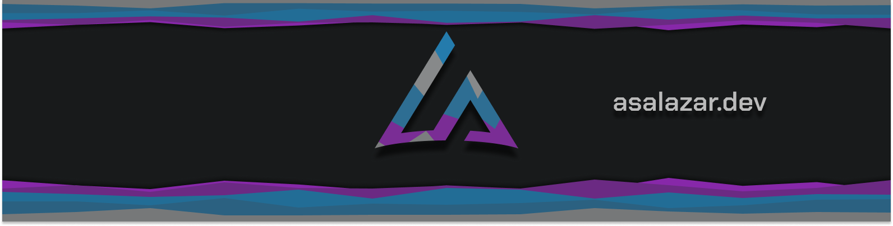
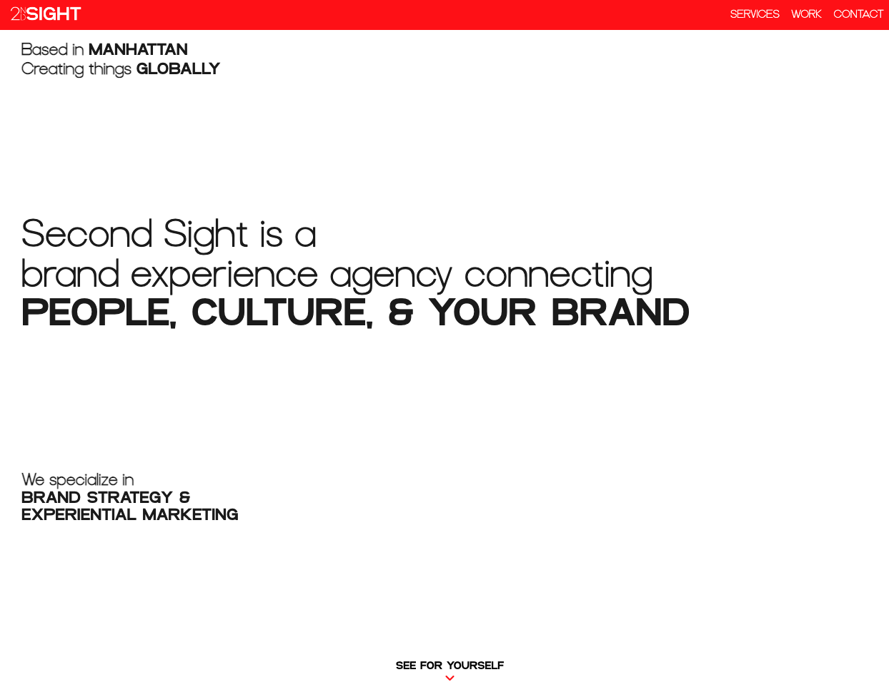

<h1 align="center">Hey 👋, I'm Alex</h1>

  
  
  
  
  

<h3 align="center">A once E-commerce Specialist turned developer, I now build functionality for the features I love.</h3>

As a software engineer, I've been able to fuse my passion in E-commerce and software development to build upon systems and bring solutions to everyday businesses. Supporting small businesses is what I do, and I hope to bring my skills to those communities around me. 

  

<h1 align="center">Projects</h1>
<table align="center" bordercolor="#66b2b2">
  
  <tr>
    <td width="50%" valign="top">
      <h3 align="center">PectusPlus.com</h3>
         
        
         
        

          
    
  
      

        
PectusPlus descrip

    </td>
    <td width="50%" valign="top">
      <h3 align="center">PectusPlus Blog</h3>
         
      
         
        

          
  
  
      

        
PectusPlus blog descrip

    </td>
  </tr>
  
  <tr>
    <td width="50%" valign="top">
      <h3 align="center">Church of Bergen Scripture Study App</h3>
       
        
       
        

  
  
      

        
Church of Bergen Scripture Study App descrip

    </td>
    <td width="50%" valign="top">
      <h3 align="center">SecondSightExperience.nyc</h3>
         
        
         
        

          
  
  
      

        
Landing page for NYC Marketing Agency client

    </td>
  </tr>
</table>

<h1 align="center">Technologies & Software</h1>

    
    
    
    
    
    
    
    
    
    
    
  

